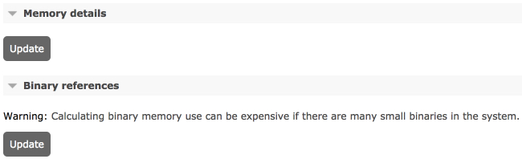
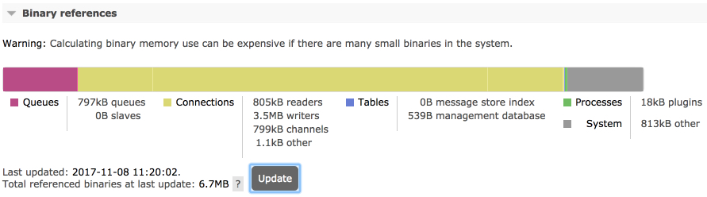
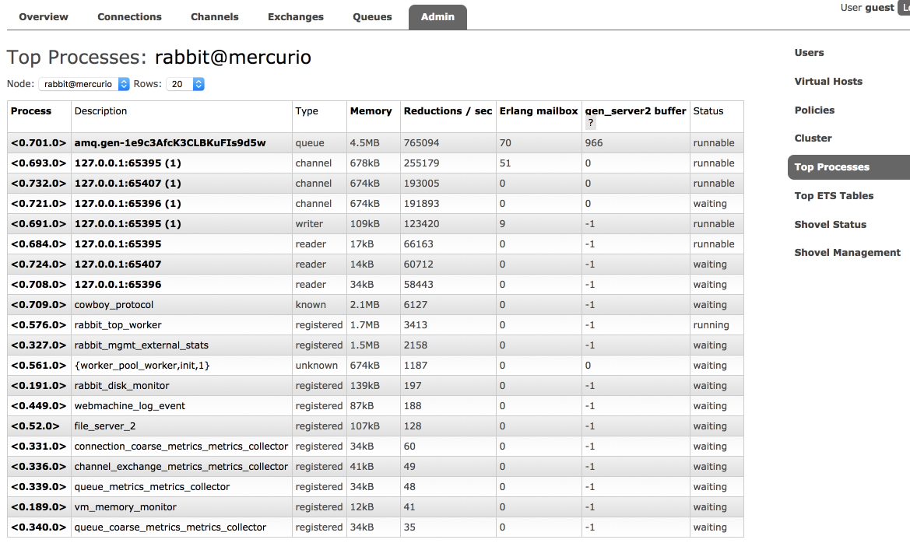
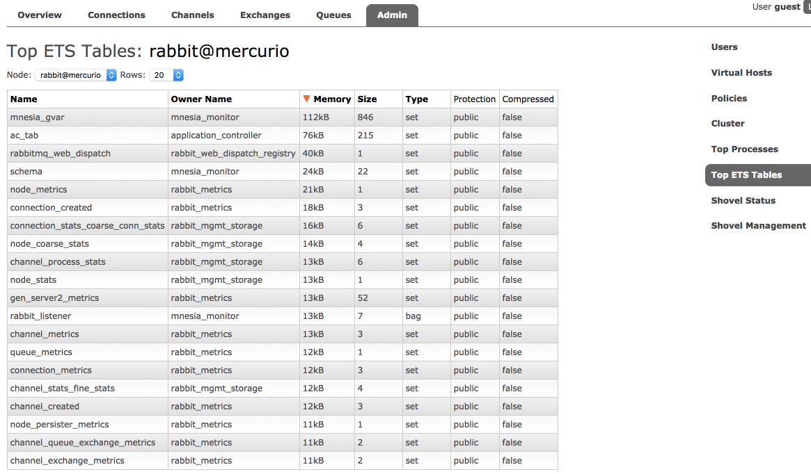
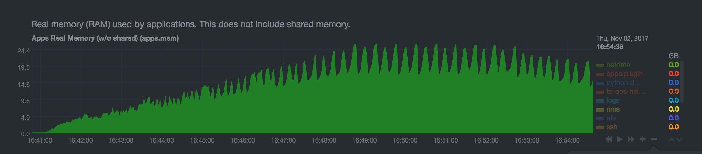

[原文链接](http://www.rabbitmq.com/memory-use.html)

# 关于内存使用的理由


## 介绍

rabbitmq提供了工具用来报告和分析节点内存使用：
- rabbitmqctl status 提供了内存分解的部分
- management ui在节点页面提供了同样的内存分解(同rabbitmqctl status一样)
- http api提供了和management ui同样的信息，用于监控
- rabbitmq-top，一个来自于top工具灵感的插件

当在推断内存使用时， 获取节点的内存分解信息应该是第一步。 

Note that all measurements are somewhat approximate, based on values returned by the underlying runtime or the kernel at a specific point in time, usually within a 5 seconds time window.

## 内存使用总量计算策略
从3.6.11开始，计算一个节点的内存使用量可以采用不同的计算策略。历史上，节点从运行时获取信息来报告内存使用（不仅仅是分配），这种策略称之为legacy(也叫erlang)是不准确，不推荐使用 。  
通过vm_memory_calculation_strategy配置计算策略。 

rss使用操作系统特定的算法，查询kernel查找节点OS进程的RSS(resident set size)数据。这种策略最精确，linux，macos，bsd，solairs系统默认使用该策略。 使用rss策略，rabbitmq每秒会运行一个短生命周期的子  每秒m进程 。 

allocated策略，是查询运行时内存分配信息，通常它的值和rss非常接近，windows系统默认使用该策略。  

vm_memory_calculation_strategy设置会影响内存报告。如果设置为legacy(erlang)或者allocated，一些内存的字段不会返回。  

使用rss策略：
```java
vm_memory_calculation_strategy = rss
```
同样的，使用allocated：
```java
vm_memory_calculation_strategy = allocated
```
经典格式配置rss：
```java
[
  {rabbit, [{vm_memory_calculation_strategy, rss}]}
].
```
经典格式配置allocated：
```java
[
  {rabbit, [{vm_memory_calculation_strategy, allocated}]}
].
```

## 内存使用分解

内存使用是如何分类的：
Memory use breakdown reports allocated memory distribution by category:

  Connections (further split into three categories: readers, writers, other)
  Channels
  Queue master replicas
  Queue mirror replicas
  Message Store and Indices
  Binaries
  Node-local metrics (stats database)
  Internal database tables
  Plugins
  Memory allocated but not yet used
  Code (bytecode, module metadata)
  ETS (in memory key/value store) tables
  Atom tables
  Other

## 使用rabbitmqctl查看内存使用

一种常用的查看内存使用的方式是通过rabbitmqctl status:

```java
{memory,
    [{connection_readers,70896},
     {connection_writers,166752},
     {connection_channels,1239768},
     {connection_other,233336},
     {queue_procs,2941784},
     {queue_slave_procs,0},
     {plugins,4633344},
     {other_proc,21878696},
     {metrics,215544},
     {mgmt_db,1244248},
     {mnesia,79296},
     {other_ets,2299848},
     {binary,4660864},
     {msg_index,47880},
     {code,25423126},
     {atom,1041593},
     {other_system,22215713},
     {allocated_unused,28552208},
     {reserved_unallocated,0},
     {total,90398720}]}
```

| Report Field         | Category                                 | Details                                  |
| -------------------- | ---------------------------------------- | ---------------------------------------- |
| total                |                                          | 使用的总内存                                   |
| connection_readers   | Connections                              | Processes responsible for connection parser and most of connection state. Most of their memory attributes to TCP buffers. The more client connections a node has, the more memory will be used by this category. See [Networking guide](http://www.rabbitmq.com/networking.html) for more information. |
| connection_writers   | Connections                              | Processes responsible for serialisation of outgoing protocol frames and writing to client connection sockets. The more client connections a node has, the more memory will be used by this category. See [Networking guide](http://www.rabbitmq.com/networking.html) for more information. |
| connection_channels  | Channels                                 | The more channels client connections use, the more memory will be used by this category. |
| connection_other     | Connections                              | Other memory related to client connections |
| queue_procs          | Queues                                   | Queue masters, indices and messages kept in memory. The greater the number of messages enqueued, the more memory will generally be attributed to this section. However, this greatly depends on queue properties and whether messages were published as transient. See [Memory](http://www.rabbitmq.com/memory.html), [Queues](http://www.rabbitmq.com/queues.html), and [Lazy Queues](http://www.rabbitmq.com/lazy-queues.html)guides for more information. |
| queue_slave_procs    | Queues                                   | Queue mirrors, indices and messages kept in memory. Reducing the number of mirrors (replicas) or not mirroring queues with inherently transient data can reduce the amount of RAM used by mirrors. The greater the number of messages enqueued, the more memory will generally be attributed to this section. However, this greatly depends on queue properties and whether messages were published as transient. See [Memory](http://www.rabbitmq.com/memory.html), [Queues](http://www.rabbitmq.com/queues.html), [Mirroring](http://www.rabbitmq.com/ha.html), and [Lazy Queues](http://www.rabbitmq.com/lazy-queues.html) guides for more information. |
| metrics              | [Stats DB](http://www.rabbitmq.com/management.html) | Node-local metrics. The more connections, channels, queues are node hosts, the more stats there are to collect and keep. See [managemeng plugin guide](http://www.rabbitmq.com/management.html) for more information. |
| stats_db             | Stats DB                                 | Aggregated and pre-computed metrics, inter-node HTTP API request cache and everything else related to the stats DB. See [managemeng plugin guide](http://www.rabbitmq.com/management.html) for more information. |
| binaries             | Binaries                                 | Runtime binary heap. Most of this section is usually message bodies and properties (metadata). |
| plugins              | Plugins                                  | Plugins such as [Shovel](http://www.rabbitmq.com/shovel.html), [Federation](http://www.rabbitmq.com/federation.html), or protocol implementations such as [STOMP](http://www.rabbitmq.com/memory-use.html) can accumulate messages in memory. |
| allocated_unused     | Preallocated Memory                      | Allocated by the runtime but not yet used. |
| reserved_unallocated | Preallocated Memory                      | Allocated/reserved by the kernel but not the runtime |
| mnesia               | Internal Database                        | Virtual hosts, users, permissions, queue metadata and state, exchanges, bindings, runtime parameters and so on. |
| other_ets            | Internal Database                        | Some plugins can use ETS tables to store their state |
| code                 | Code                                     | Bytecode and module metadata. This should only consume double digit % of memory on blank/empty nodes. |
| other                | Other                                    | All other processes that RabbitMQ cannot categorise |

## 使用management ui查看内存使用

管理插件提供了内存使用的图表。 






## 使用HTTP API和curl查看内存使用

通过GET /api/nodes/{node}/memory端点获取内存信息：
```java 
curl -s -u guest:guest http://127.0.0.1:15672/api/nodes/rabbit@mercurio/memory |
  python -m json.tool

{
    "memory": {
        "atom": 1041593,
        "binary": 5133776,
        "code": 25299059,
        "connection_channels": 1823320,
        "connection_other": 150168,
        "connection_readers": 83760,
        "connection_writers": 113112,
        "metrics": 217816,
        "mgmt_db": 266560,
        "mnesia": 93344,
        "msg_index": 48880,
        "other_ets": 2294184,
        "other_proc": 27131728,
        "other_system": 21496756,
        "plugins": 3103424,
        "queue_procs": 2957624,
        "queue_slave_procs": 0,
        "total": 89870336
    }
}
```
亦可以使用/api/nodes/{node}/memory端点查询使用内存比例：
```java
curl -s -u guest:guest http://127.0.0.1:15672/api/nodes/rabbit@mercurio/memory/relative |
  python -m json.tool

{
    "memory": {
        "allocated_unused": 32,
        "atom": 1,
        "binary": 5,
        "code": 22,
        "connection_channels": 2,
        "connection_other": 1,
        "connection_readers": 1,
        "connection_writers": 1,
        "metrics": 1,
        "mgmt_db": 1,
        "mnesia": 1,
        "msg_index": 1,
        "other_ets": 2,
        "other_proc": 21,
        "other_system": 19,
        "plugins": 3,
        "queue_procs": 4,
        "queue_slave_procs": 0,
        "reserved_unallocated": 0,
        "total": 100
    }
}
```
这个比例（各个类别占用的百分比）主要用于识别占用内存高的类别，并不非常精确。 


## 内存使用分类

- 连接(connection)  

  包含接入的连接和channel，以及插件使用的连接。 主要的内存消耗在TCP和其他类型的buffer上。 查看[Networking](http://www.rabbitmq.com/networking)了解详情  

- 队列和消息

  队列，队列索引，队列状态，入队的消息这些使用的内存属于这个类别。 

  队列在内存吃紧时会交换它的内容到磁盘上。具体的行为取决于队列属性，客户端发布的消息类型(持久化还是瞬时)，和持久化配置。   

  消息体不属于这个类别，而是在二进制数据中。 

- 消息存储索引

  默认消息存储为所有消息使用内存索引，包括交换到磁盘上的消息。 插件可以使用基于磁盘的方式替换。 

- 插件

  插件使用的内存。 包括一些协议插件比如STOMP和MQTT的预连接内存，以及像Shovel和Federation插件中的入队消息。 

- 预分配内存

  运行时分配的内存(VM分配)，但没使用。 

- 内部数据库

  内部数据库(mnesia)在内存中保持着所有节点数据(磁盘节点也一样)。通常当存在大量的队列，交换机，绑定，用户和vhost时，会占用较多内存。 插件也会存储数据到相同的数据库。 

- 管理插件(统计)数据库

  统计数据库。 大部分统计信息存储在本地节点。 跨节点的聚合统计数据会被缓存，缓存数据属于这个类别。 

- 二进制数据

运行时共享的二进制数据。绝多多数内存使用在消息体和元数据上。 

- ETS表

除了内部数据库和统计数据库之外的其他的内存表。 

- 代码

  代码使用的内存(bytecode，module metadata)。 这部分使用通常恒定并且相对较少。 

- Atom

  atoms使用的内存，应该是恒定的。 

## 使用rabbitmq-top分析每个进程

rabbitmq-top是一款用来查看运行时进程消耗内存和cpu的插件 。 

使用`rabbitmq-pulgins enable rabbitmq_top`启用。 该插件在mangment ui新增了管理的tab，显示了top的进程(内存使用，reductions-cpu消耗度量， erlang mailbox length， gen_server2进程buffer) ： 



第二个tab显示了ETS(内部的key/value存储)表，包括内存使用和行数。



## 内存使用监控

非常建议在生产环境监控集群中所有节点的内存使用。通过内存使用监控(分类)+其他指标，如并发连接数或者入队消息数，使得在应用程序存在反常时，提前监测到问题(如连接泄露、不停的增长消息但没有消费者)。 

## 预分配内存

Erlang memory breakdown reports only memory is currently being used, and not the memory that has been allocated for later use or reserved by the operating system. OS tools like ps can report more memory used than the runtime. This memory consists of allocated but not used, as well as unallocated but reserved by the OS. Both values depend on the OS and Erlang VM allocator settings and can fluctuate significantly.

Note that the sections depend on the vm_memory_calculation_strategy setting. If the strategy is set to erlang, unused memory will not be reported. If memory calculation strategy is set to allocated, memory reserved by OS will not be reported. Therefore rss is the strategy that provides most information from both the kernel and the runtime.

Runtime's memory allocator behavior can be tuned, please refer to erl and erts_alloc documentation.

(ps://将的是内存计算策略中，计算的内存包括的部分，已经使用的，分配未使用的，系统保留的， erlang只计算第一部分，allocated计算第一和第二部分， rss计算三个部分，没啥好说的)。

## 队列内存

- 一个消息使用多少内存？  

  有效负荷(payload) - >=1byte - 动态长度，通常几百字节到几百千字节  
  协议属性(protocol attribute) - >=0byte - 动态长度，包括headers，priority，timestamp，reply to 等等。   
  rabbitmq元数据(metadata) - >= 720 bytes - 动态长度，包括exchange，routing key，message properties，persistence， redelivery status 等等  
  RabbitMQ message ordering structure - 16 bytes。

 一个1k的有效负荷的消息，一旦属性和元数据加上后，会使用2k的内存。   

 有的消息可以保存到磁盘上，但其元数据依然在内存中 。   

 - 一个队列使用多少内存？

  一个队列就是一个erlang进程，如果队列镜像了，那么每个镜像就是不同的erlang进程。 

  因为一个队列是单个eralng进程，消息排序可以得到保障。 多个队列意味着多个不同的erlang进程，它们获取同样的cpu时间，确保没有队列会阻塞其他队列。   

  通过HTTP API可以获取单个队列的内存使用情况:
```java
curl -s -u guest:guest http://127.0.0.1:15672/api/queues/%2f/queue-name |
  python -m json.tool

{
    ..
    "memory": 97921904,
    ...
    "message_bytes_ram": 2153429941,
    ...
}
```
 memory : 队列进程占用的内存。 包括消息元数据(每个消息至少720字节)，不包括超过64k的消息负载。   
 message_bytes_ram : 消息负载使用内存，不管大小。 

 比如：如果消息小，那么消息元数据会使用比消息负载更多的内存。反之一样。  10000个1byte负载的消息会使用10KB的message_bytes_ram(payload) 和 7MB的 memory(metadata)。 而10000个10KB负载的消息使用976MB的message_bytes_ram(payload) 和 7MB的 memory(metadata)。  
- 为何当发布/消费消息时，队列内存会出现波动（grow and shrink）？

erlang为每个进程使用[generational garbage collection](https://www.erlang-solutions.com/blog/erlang-19-0-garbage-collector.html)回收垃圾。垃圾回收作用在每个队列，和所有其他erlang进程独立。  

当在垃圾回收时，取消分配未使用内存之前，会复制进程使用的内存（PS://听起来像是复制算法)，这会导致队列进程使用内存增长到两倍。比如下图中一个含有大量消息的队列，在垃圾回收时的内存使用情况：



- 队列内存在垃圾回收过程中增长会有危险吗？

当erlang vm尝试分配比可用内存更多的内存时，VM要么自己会crash，要么会被oom killer 杀掉。 当erlang vm crash， rabbitmq会丢失所有非持久化数据(ps://听起来好危险)

内存上限可以阻止发布和新消息进入队列。 因为垃圾回收可能使用双倍内存，所以内存上限设置高于0.5是不安全的。默认的内存上限为0.4，这是安全的，因为队列没有使用所有内存。 

建议多队列，这样内存分配/垃圾回收就会在不同的erlang 进程中分开。   

如果队列中的消息使用了大量的内存， 建议使用lazy队列，这样消息会尽快保存到磁盘上，没必要长期保存在内存中。 
